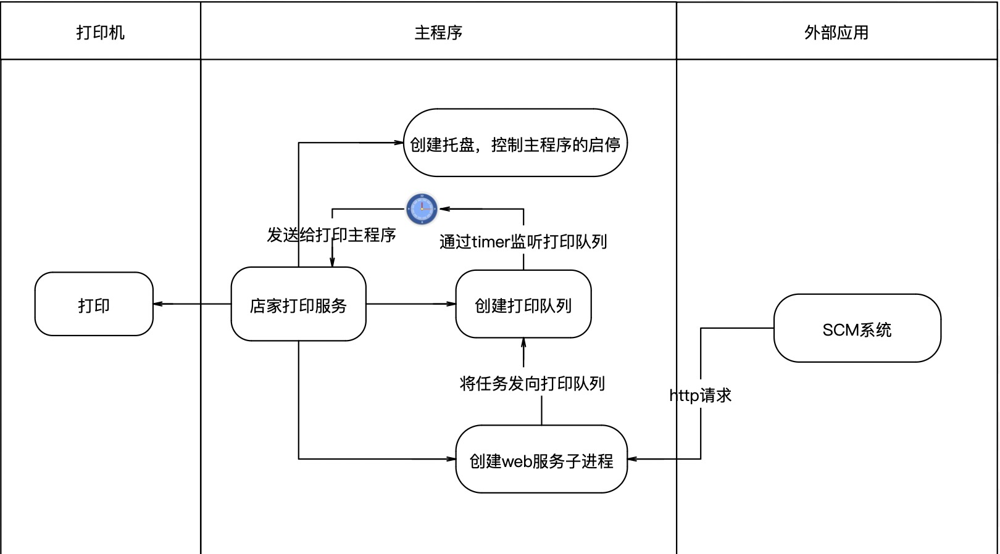
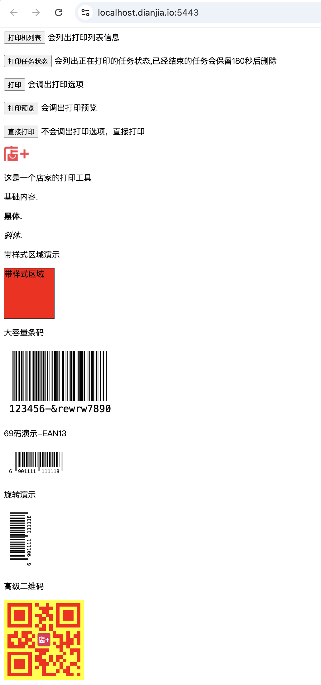
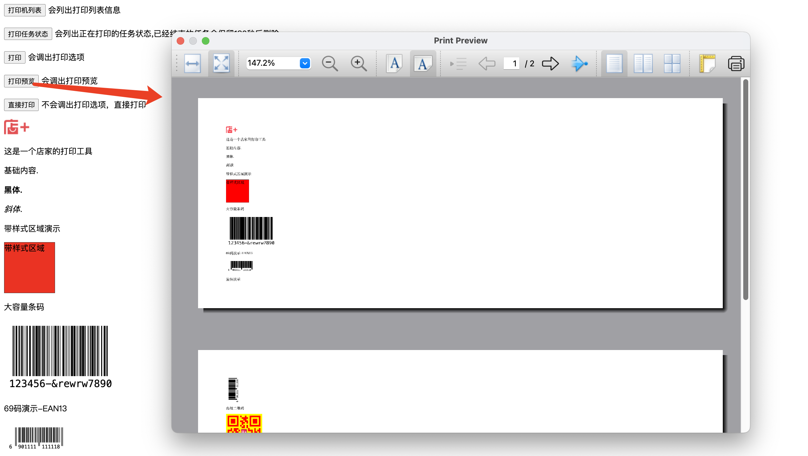
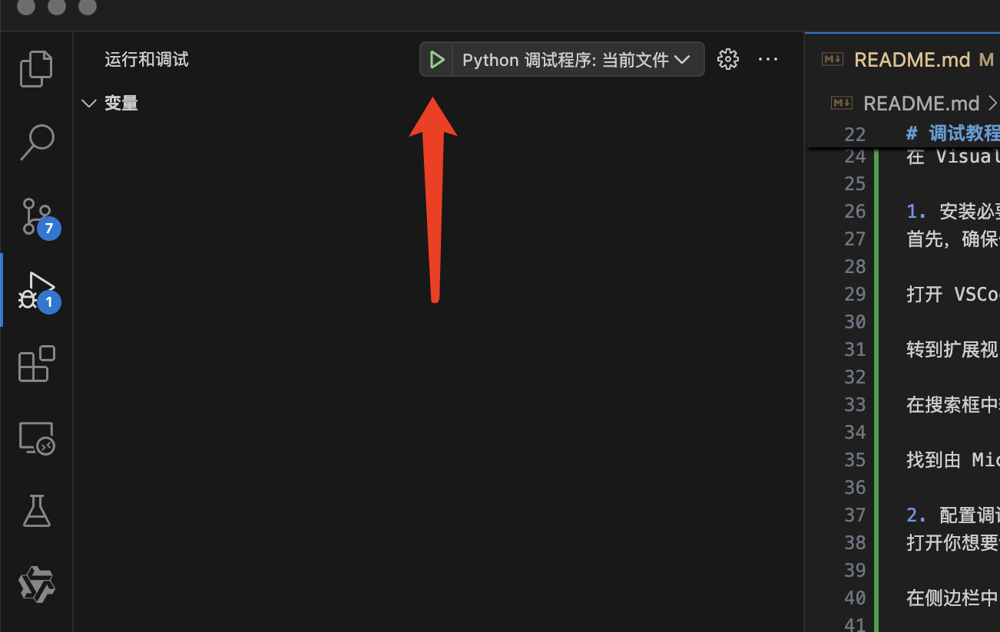
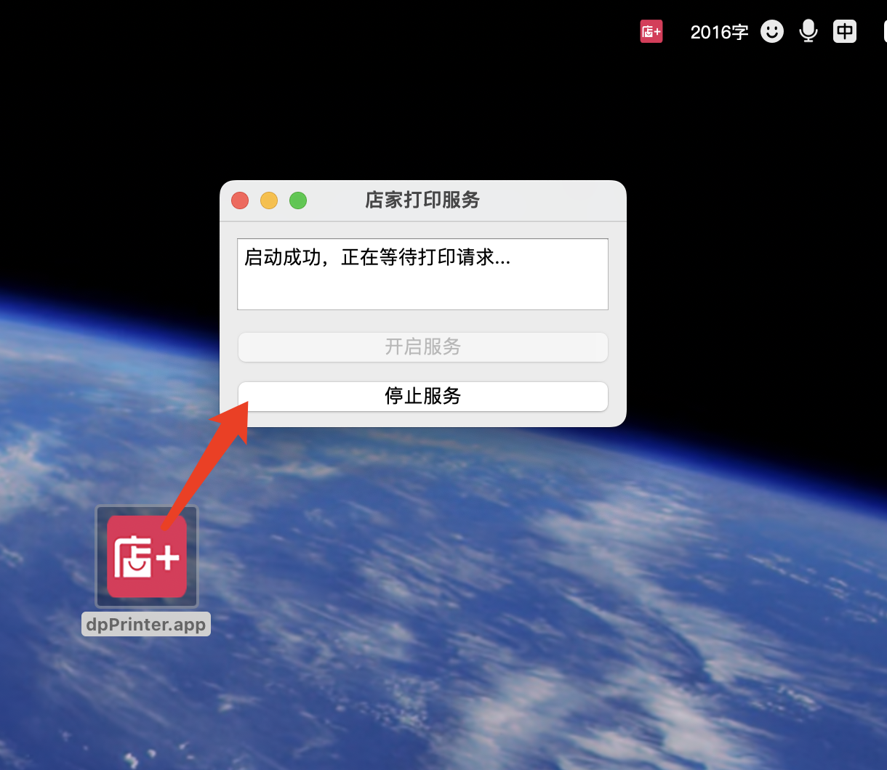

要求python 3.9+

# 架构

# 安装 

# 创建虚拟环境
python -m venv .venv 

mac下执行以下指令 激活环境

source .venv/bin/activate

windows下执行执行以下指令 激活环境

.venv\Scripts\activate 

# 安装 requirements.txt文件中的依赖 这是类似maven中的pom文件
pip install -r requirements.txt

# 运行启动
python app.py 

# 测试页访问 

浏览器访问

本地http访问: http://127.0.0.1:5100

本地https访问: https://127.0.0.1:5443

域名http访问: http://localhost.dianjia.io:5100 //这个域名是一个很特殊的域名，ip是解析到127.0.0.1的，需要开发者可以用自己域名制作一条A记录指向本地ip，当然也可以直接使用我们的域名

域名https访问: https://localhost.dianjia.io:5443 //这个域名是一个很特殊的域名，ip是解析到127.0.0.1的，需要开发者可以用自己域名制作一条A记录指向本地ip，当然也可以直接使用我们的域名，我们会定期更新HTTPS证书

# 访问效果

# 打印预览效果

# 调用案例

    jquery 请求案例，当然你也可以使用react 或者 vue 等主流框架来发起请求

        //利用jquery发起异步的post请求
        //请求格式需要用json格式发送格式为{"taskKey":new Date().getTime(),"content":"encodeURIComponent后的打印内容","options":{}}

            //获取打印机列表
            $.ajax({
                url: '/printer_status',
                type: 'POST',
                contentType: 'application/json',
                success: function (data) {
                    alert(JSON.stringify(data));
                },
                error: function (e) {
                    alert(e.message);
                }
            });
            //获取打印任务
            $.ajax({
                url: '/print_tasks',
                type: 'POST',
                contentType: 'application/json',
                success: function (data) {
                    alert(JSON.stringify(data));
                },
                error: function (e) {
                    alert(e.message);
                }
            });
            //打印
            $.ajax({
                url: '/print',
                type: 'POST',
                contentType: 'application/json',
                data: JSON.stringify({
                    taskKey: new Date().getTime(),//可以使用业务的唯一标识，用于查询打印状态
                    content: encodeURIComponent($('#content').html()),
                    options: {
                        //printerName:"HP_LaserJet_400_M401dne__AFFC44_",//打印机名称可以通过调用printer_status接口获取
                        pageRect: {
                            width: 210,//纸张宽度 单位mm
                            height: 297,//纸张宽度 单位mm
                        },
                        margins: {
                            left: 10,//纸张左边距 单位mm
                            top: 10,//纸张顶边距 单位mm
                            right: 10,//纸张右边距 单位mm
                            bottom: 10,//纸张底边距 单位mm
                        },
                        printCount: 1,//打印份数，默认为1
                        // orientation: "landscape", // 页面方向 portrait纵向 landscape横向,默认为纵向
                        // duplex: "none",// 双面打印 none单面打印，auto双面打印，long长边翻转，short短边翻转
                        // colorMode: "grayScale",// 打印颜色模式 GrayScale灰度模式，Color彩色模式，默认为灰度模式
                        // pageScopes: {
                        //     from: 1,//打印页码范围，默认为1
                        //     to: 1
                    }
                }),
                success: function (data) {
                    alert('请求成功');
                },
                error: function (e) {
                    alert(e.message);
                }
            });
            //打印预览
            $.ajax({
                url: '/preview',
                type: 'POST',
                contentType: 'application/json',
                data: JSON.stringify({
                    content: encodeURIComponent($('#content').html()),
                    options: {
                        taskKey: new Date().getTime(),//可以使用业务的唯一标识，用于查询打印状态
                        //printerName:"HP_LaserJet_400_M401dne__AFFC44_",//打印机名称可以通过调用printer_status接口获取
                        pageRect: {
                            width: 200,//纸张宽度 单位mm
                            height: 80,//纸张宽度 单位mm
                        },
                        margins: {
                            left: 10,//纸张左边距 单位mm
                            top: 10,//纸张顶边距 单位mm
                            right: 10,//纸张右边距 单位mm
                            bottom: 10,//纸张底边距 单位mm
                        },
                        orientation: "landscape", // 页面方向 portrait纵向 landscape横向,默认为纵向
                        // duplex: "none",// 双面打印 none单面打印，auto双面打印，long长边翻转，short短边翻转
                        // colorMode: "grayScale",// 打印颜色模式 GrayScale灰度模式，Color彩色模式，默认为灰度模式
                        // pageScopes: {
                        //     from: 1,//打印页码范围，默认为1
                        //     to: 1
                        // }
                    }
                }),
                success: function (data) {
                    alert('请求成功');
                },
                error: function (e) {
                    alert(e.message);
                }
            });
            //直接打印
            $.ajax({
                url: '/direct_print',
                    type: 'POST',
                    contentType: 'application/json',
                    data: JSON.stringify({
                        taskKey: new Date().getTime(),//可以使用业务的唯一标识，用于查询打印状态
                        content: encodeURIComponent($('#content').html()),
                        options: {
                            pageRect: {
                                width: 210,//纸张宽度 单位mm
                                height: 297,//纸张宽度 单位mm
                            },
                            margins: {
                                left: 10,//纸张左边距 单位mm
                                top: 10,//纸张顶边距 单位mm
                                right: 10,//纸张右边距 单位mm
                                bottom: 10,//纸张底边距 单位mm
                            },
                            orientation: "portrait", // 页面方向 portrait纵向 landscape横向,默认为纵向
                        }
                    }),
                    success: function (data) {
                        alert('请求成功');
                    },
                    error: function (e) {
                        alert(e.message);
                    }
                });
# 调试教程
python vscode 调试

在 Visual Studio Code (VSCode) 中进行 Python 调试是一个非常直观和高效的过程。下面是如何在 VSCode 中设置和运行 Python 调试的基本步骤：

1. 安装必要的扩展

首先，确保你已经安装了 Python 扩展。你可以通过以下步骤安装：

打开 VSCode。

转到扩展视图，可以通过点击侧边栏的方块图标或使用快捷键 Ctrl+Shift+X。

在搜索框中输入 Python。

找到由 Microsoft 发布的 Python 扩展（通常是第一个结果），然后点击安装。

2. 配置调试环境

打开你想要调试的 Python 文件。

在侧边栏中，点击“运行和调试”图标（一个小虫子图标）。

在顶部，点击“创建 launch.json 文件”，选择 Python。这会为你创建一个 launch.json 文件，用于配置调试。

3. 编辑 launch.json

launch.json 文件通常会自动为你生成一些基本的配置。你可以根据需要修改这个文件。一个基本的配置示例如下：

{
    "version": "0.2.0",
    "configurations": [
        {
            "name": "Python 调试程序: 当前文件",
            "type": "debugpy",
            "request": "launch",
            "program": "${替换成自己的路径}/py-webprinter/app.py",
            "console": "integratedTerminal"
        }
    ]
}
4. 运行调试

# 如何生成requirements.txt文件
pip freeze > requirements.txt

# Https支持
后续会支持 https://localhost.dianplus.cn:5443/ 安全访问

原理是在DNS设置A记录，将域名解析到127.0.0.1

A记录：localhost->127.0.0.1

应用需要支持定期监控证书，并定期更新证书，当识别到证书有更新，则更新证书

更新的证书店加公司会定期发布到OSS对应的公开目录，当然这个文件可以自己另行处理

http://mugua-file.oss-cn-hangzhou.aliyuncs.com/ssl/localhost.dianjia.io.key
    
http://mugua-file.oss-cn-hangzhou.aliyuncs.com/ssl/localhost.dianjia.io.pem

# 依赖介绍
# 强大的GUI 框架 
pyqt6 

这个框架支持macos windows linux 

学习地址：https://www.bilibili.com/video/BV11C4y1P7fj/?spm_id_from=333.337.search-card.all.click&vd_source=d8b4286a7d19d13c14e03c29f1791ba5

# pyqt6对应的浏览器引擎 Chrome内核
PyQt6-WebEngine

# 默认web框架
flask 

# http请求库
requests 

# 轻量级生产web框架
gunicorn 

# 可执行文件打包工具

pyinstaller 

可打包成可支持exe或macos的app文件

pyinstaller文档:https://pyinstaller.org/en/stable/usage.html

安装包图片准备：https://www.aconvert.com/cn/image/png-to-icns 可以通过这个网站将图片转换成icns格式

打包命令

pyinstaller --add-data "templates:./templates" --add-data "static:./static" --collect-all gunicorn --icon=install.icns --name dpPrinter --clean --windowed app.py 
   
mac app效果演示

# 其他可选安装，类似于制作java 的jar包

pip install setuptools

pip install wheel

python setup.py sdist bdist_wheel

python setup.py install

# 中央仓库工具，类似上传nexus这样的maven仓库，这个事情非必须

pip install twine

twine upload dist/*

# 下载安装包，弄成本地可执行命令 这个事情非必须
pip install .

pip install dist/dianplus_printer-0.0.1-py3-none-any.whl

